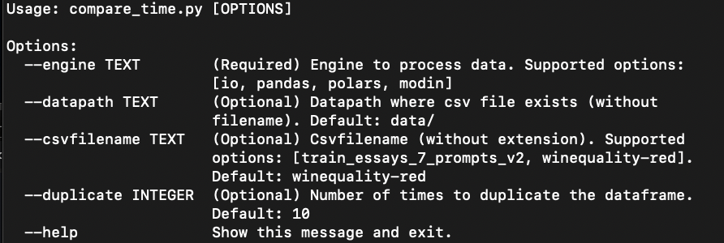

## Performance Analysis: Read-In, Write-Out with Native IO, Pandas, Polars, and Modin

<p align="center">
    
</p>

### Dependencies
- Dependencies in [requirements.txt](requirements.txt)
- Install with
    ```
    python -m pip install -r requirements.txt
    ```

### Data

- Small-sized data: [winequality-red.csv](https://github.com/aniruddhachoudhury/Red-Wine-Quality/blob/master/winequality-red.csv) (0.1 Mb~)

- Large-sized data: [train_essays_7_prompts_v2.csv](https://www.kaggle.com/datasets/rabiar/train-essays-7-v2) (36.5 Mb~)


## How to run 

### Guidelines

```
python compare_time.py --help
python compare_memory.py --help
```


### Examples

Run with
```
python compare_time.py --engine polars

python compare_time.py --engine polars --datapath data/ --csvfilename winequality-red --duplicate 10
```

## Performance Evaluation

### Computer Specifications
- **CPU**: Intel i9 with 18 cores and 36 threads
- **Memory**: 62 Gb


### Time Consumption

|Engine | winequality-red.csv (0.1 Mb~) | train_essays_7_prompts_v2.csv (36.5 Mb~)|
|:--:|:--:|:--:|
|Native IO| 0.01 s | 1.99 s |
|Polars| 0.18 s | 3.93 s  |
|Pandas| 0.46 s | 10.12 s |
|Modin| 10.09 s  | 16.56 s|


### Memory Consumption (Maximum Memory Usage)   
|Engine | winequality-red.csv (0.1 Mb~) | train_essays_7_prompts_v2.csv (36.5 Mb~)|
|:--:|:--:|:--:|
|Native IO| 42.8 MiB | 42.9 MiB |
|Polars| 75.3 MiB  | 692.0 MiB |
|Pandas| 145.5 MiB | 503.9 MiB |
|Modin| 260.9 MiB  | 256.1 MiB |


## Tradeoffs
|Tradeoffs | Advantages | Disadvantages|
|:--|:--|:--|
|Native IO| Maximum optimization in both time and memory aspect. | Not a tool for data analysis |
|Polars| Excels in speed compares to Pandas | Small learning curve. Functionalities is a subset of Pandas Library. |
|Pandas| Comprehensive in functionalities. | Increasing time and memory consumption with file size |
|Modin| Designed to leverage multiple cores and distributed computations. | Small learning curve. |

