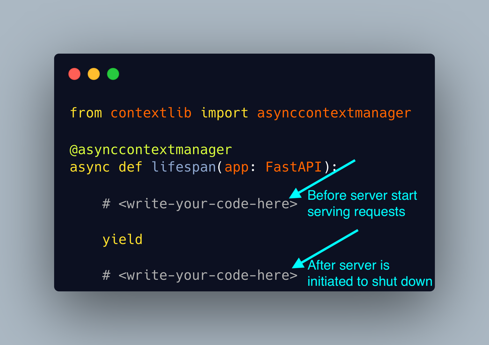

## Managing Lifespan Events in FastAPI with Redis Example

### Install dependencies
```
python -m pip install -r requirements.txt
```

### Sample Code




### [Redis](https://github.com/redis/redis-py)

- Initialize redis in docker
```
docker run -p 6379:6379 -it redis/redis-stack:latest
```

### FastAPI Server
```
uvicorn server:app --port 8000
```

### References
- https://fastapi.tiangolo.com/advanced/events/
